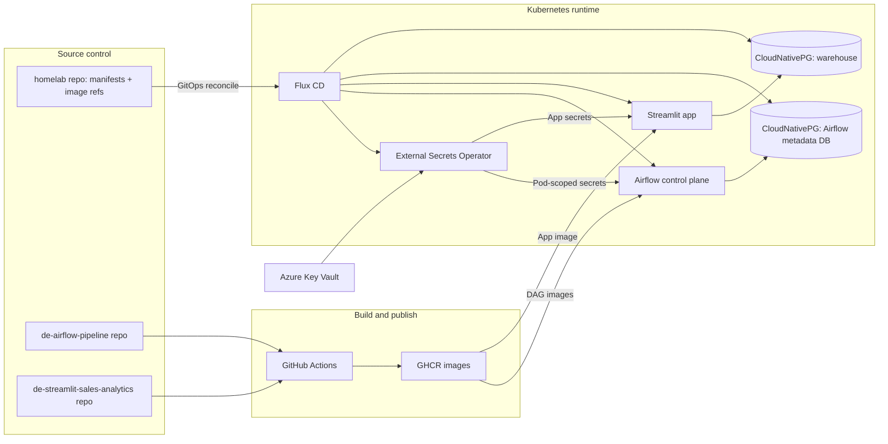
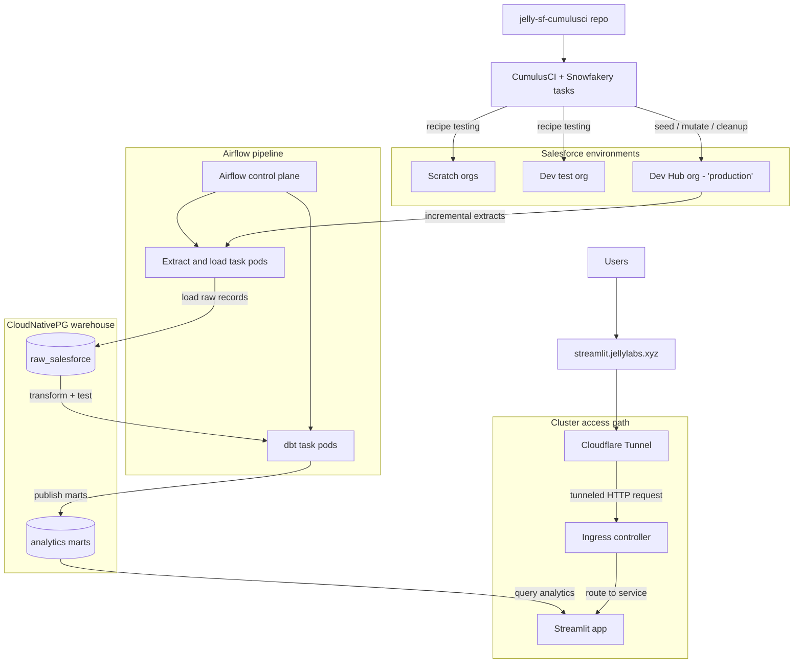

---
categories:
- data-engineering
- devops
- homelab
date: 2026-03-10 08:56:05 -0400
tags:
- airflow
- cloudnative-pg
- cumulusci
- dbt
- flux
- kubernetes
- salesforce
- snowfakery
- streamlit
title: 'Kubernetes Managed Data Analytics Pipeline - Part 1: Intro and Target Architecture'
mermaid: true
---

# Series Introduction

Over the past few years, I have worked on different parts of data platforms, but usually one slice at a time. I have written extraction code, dealt with database issues, built transformations, and put reporting in front of users. What I wanted here was an end-to-end project that forced those pieces to work together in one system.

The result is a Salesforce-to-analytics pipeline running on my Kubernetes homelab. It is not meant to be a perfect production blueprint, but it is not just a toy either. The goal was to build something production-shaped, with real orchestration, real state, real secrets management, repeatable deployments, and a reporting layer that depends on the output.

I also wanted the project to sit in an interesting middle ground. Kubernetes is absolutely more platform than a small personal analytics stack strictly needs, but that is part of the point. I wanted one runtime for orchestration, transformation workloads, database operators, secret delivery, and the final app. It was also a way to turn some unknown unknowns into known unknowns. I had enough context to know tools like Airflow, CloudNativePG, CumulusCI, and Streamlit were relevant, but not enough hands-on experience to judge where they helped, where they added friction, and what they would demand in a real system.

The stack ended up looking like this:

- Airflow for orchestration
- Python tasks in Airflow for extraction and loading
- dbt for testing, transformation, and data mart creation
- CloudNativePG for the Airflow metadata database and warehouse
- Streamlit for BI reporting on top of the warehouse
- CumulusCI and Snowfakery for repeatable synthetic Salesforce data

This series is a walkthrough of that system from the outside in. It covers the platform foundation, how Airflow runs on Kubernetes, how the Salesforce extraction contract works, how synthetic data keeps the pipeline interesting, how dbt turns raw loads into marts, and how the Streamlit layer exposes the result.

It is also a record of the compromises. This setup runs in a homelab with limited hardware, a single primary environment, and plenty of rough edges. That is useful in its own right, because a lot of engineering value comes from seeing which patterns still make sense when you scale them down and which ones only look good on architecture diagrams.

## Target Architecture at a Glance

This is easier to read as two views: one for how the platform gets delivered to the cluster, and one for how data moves from Salesforce into analytics.

### Delivery and Runtime View

### Pipeline and Analytics Flow

## Repositories

- Homelab (GitOps manifests): <https://github.com/chris-jelly/homelab>
- Airflow pipeline (DAGs + images): <https://github.com/chris-jelly/de-airflow-pipeline>
- Salesforce synthetic data workflow: <https://github.com/chris-jelly/jelly-sf-cumulusci>
- Streamlit app: <https://github.com/chris-jelly/de-streamlit-sales-analytics>

## Project Limitations

This setup is intentionally production-shaped, but it is still a homelab project. To keep the scope finishable and the hardware demands reasonable, I cut a few things I would want in a production system:

- Separate dev, staging, and production environments with a real promotion path
- Backup and restore procedures for both Airflow state and warehouse data
- Observability and alerting strong enough that you could realistically be on call for it

Some of those gaps show up later in the series, and a few may turn into follow-on improvements as the project evolves.

## What Comes Next

Part 2 covers the platform foundation: my local `k3d` loop, the Flux GitOps path to the cluster, and the couple of platform pieces everything else depends on.
