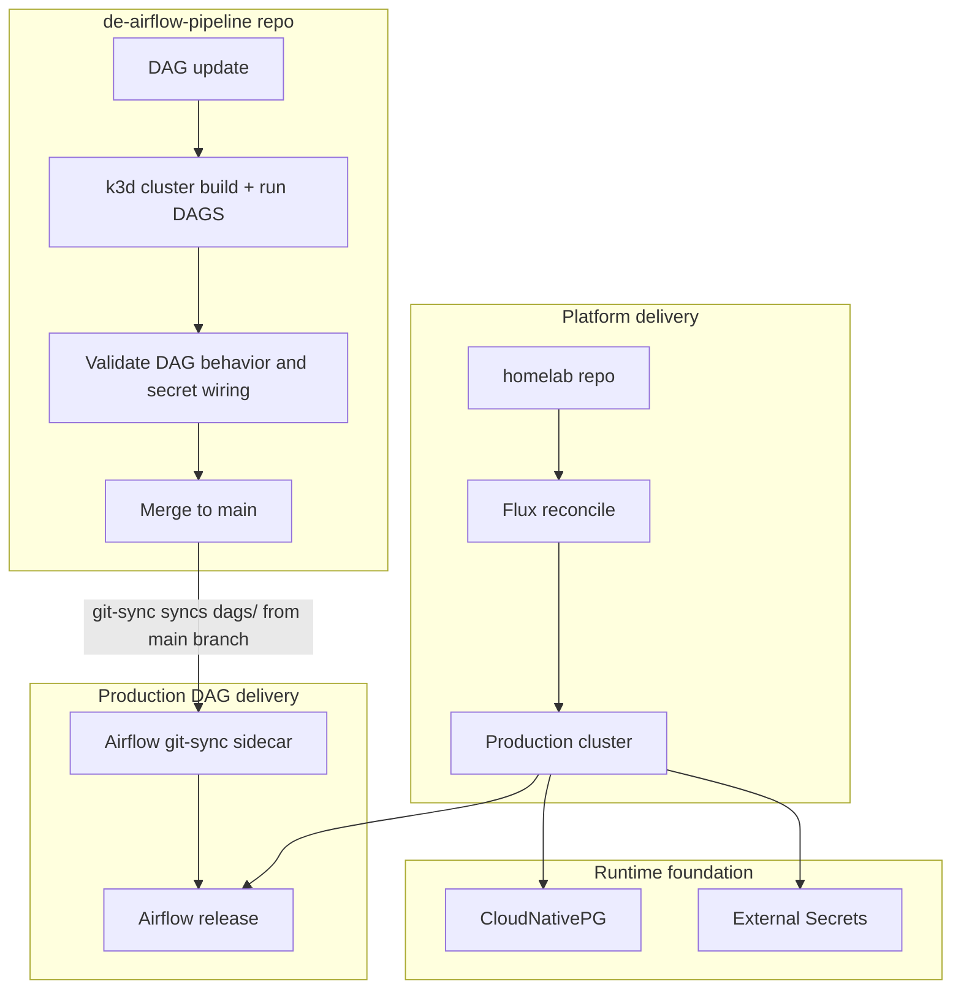

---
categories:
- data-engineering
- devops
- homelab
date: 2026-03-13 08:06:53 -0400
tags:
- cloudnative-pg
- external-secrets
- flux
- gitops
- k3d
- kubernetes
title: 'Kubernetes Managed Data Analytics Pipeline - Part 2: Platform Foundation'
mermaid: true
---

# Platform Foundation

When this project started, my goal was plain: "deploy Airflow on Kubernetes." With my existing Kubernetes homelab, there were already a few decisions made. I needed to deploy it through GitOps with Flux (<https://fluxcd.io/flux/concepts/>), which meant either writing a lot of YAML for the Airflow configuration or using the Helm chart provided by Apache Airflow (<https://airflow.apache.org/docs/helm-chart/stable/index.html>) and a more manageable amount of YAML. Helm it is.

Then, when it came time to develop my DAGs locally, I wanted the development environment to mirror production as closely as possible so local tests would give some confidence that the code would still work after being pushed. For that I use `k3d` (<https://k3d.io>), a wrapper around k3s that makes it easy to run small Kubernetes clusters in the developer workflow.

## Local-to-Production Flow

At a high level, the workflow is split into two loops. The first is a local loop inside the `de-airflow-pipeline` DAG repository where I can validate DAG behavior, secret wiring, and the general shape of the Kubernetes deployment using `k3d` without needing to repeatedly deploy to and wait for reconciliation in the production cluster. The second is the production path, where that same repo uses Airflow's `git-sync` sidecar pattern (<https://airflow.apache.org/docs/helm-chart/stable/manage-dag-files.html#using-git-sync>) to update the DAGs Airflow runs while the homelab repo defines the platform resources that Flux reconciles into the cluster (databases, secrets, and so on).

This gives us a local development workflow that is reasonably close to the production tooling. Things that fail in production are more likely to fail in the same way in dev (after all, they both run on k3s).

The actual flow looks like this:

## Why CloudNativePG and External Secrets

One of the points of using GitOps workflows is making the deployment process repeatable such that you can point a new cluster at the configuration and everything would deploy. In this case, the two problems in the way of that goal were secret delivery and database management on Kubernetes.

It did not take much research into "how to run databases on Kubernetes" to land on CloudNativePG (<https://cloudnative-pg.io/>). It provides an operator-managed way to run both the Airflow metadata database and the warehouse, which is much closer to the shape I would expect in a real platform than hand-managing a PostgreSQL deployment.

External Secrets Operator (ESO) (<https://external-secrets.io/latest/>) plays the same role for credentials. Salesforce access, database connections, and app configuration all need to exist somewhere outside a pile of manually created Kubernetes secrets. Pulling them from a backing secret store means I can tear down the cluster, recreate it, and get back to a working system by just creating one secret that allows ESO to reach the secret store and pull in the rest.

In summary, `k3d` and Flux define the delivery workflow, but CloudNativePG and External Secrets are what make the platform durable enough to rebuild once the deployment reaches production.

The repos behind this are here if you want to inspect the setup directly:

- Homelab (Flux + platform manifests): <https://github.com/chris-jelly/homelab>
- Airflow pipeline (local `k3d` workflow/scripts): <https://github.com/chris-jelly/de-airflow-pipeline>

## If This Were Production

This flow is good enough for my homelab, but I would go further in a real production setup. The biggest gap is a proper promotion path: separate dev and staging Airflow environments, each with its own infrastructure and checks before changes move to the next stage.

## What Comes Next

Part 3 dives into how Airflow actually runs workloads in Kubernetes, including how I am shipping DAG code, how and why I use per-DAG images, and how I scope secrets to worker pods for isolation.
