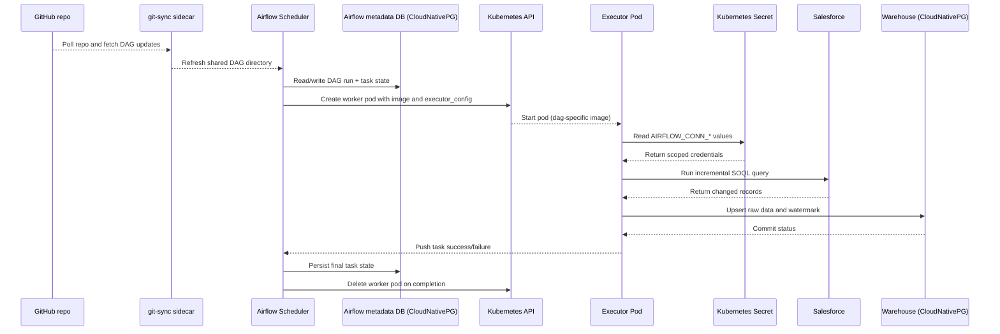

---
categories:
- data-engineering
- devops
- homelab
date: 2026-03-17 8:00:00 -0400
tags:
- airflow
- dag-images
- git-sync
- kubernetesexecutor
- secrets
title: 'Kubernetes Managed Data Analytics Pipeline - Part 3: Airflow on Kubernetes
  Execution Model'
mermaid: true
---


# Airflow on Kubernetes Execution Model

Airflow is the orchestration layer in this setup, and while I had used it previously via simpler docker or cloud deployments, I had some learning to do in order to adapt to the runtime model on Kubernetes and the different pod executor options provided there. From the options available, I chose the model unique to Kubernetes: `KubernetesExecutor` (<https://airflow.apache.org/docs/apache-airflow-providers-cncf-kubernetes/stable/kubernetes_executor.html>), where the scheduler discovers DAGs, tracks state, and asks Kubernetes to launch short-lived worker pods that run the extraction and transformation work.

This post covers that runtime model. In practice, that means three things: how DAG code reaches the scheduler, how tasks turn into Kubernetes pods, and how to keep dependencies and secrets scoped tightly enough that one workflow does not become coupled to every other workflow in the system.

## How the Runtime Fits Together

The core setup is Airflow running with `KubernetesExecutor`. The scheduler and webserver stay in the control plane, while each task instance gets launched as its own Kubernetes pod. DAG definitions are delivered into Airflow with the `git-sync` sidecar pattern (<https://airflow.apache.org/docs/helm-chart/1.7.0/manage-dags-files.html#mounting-dags-using-git-sync-sidecar-without-persistence>), which keeps the scheduler pointed at the latest version of the repository without requiring a full image rebuild every time I change orchestration code.

The task runtime is separate from DAG delivery. For the work itself, I use DAG-specific container images so dependencies do not bleed across unrelated workflows. Each new task pod starts with the image defined in the DAG's executor configuration, and with `image_pull_policy="Always"` Kubernetes will try to pull the latest version before the container starts. While this adds some CI and image management overhead for each DAG, it keeps the execution environment explicit.

Each DAG defines overrides like this to specify the image and the secrets available to the worker pod:

```python
executor_config = {
    "pod_override": k8s.V1Pod(
        spec=k8s.V1PodSpec(
            containers=[
                k8s.V1Container(
                    name="base",
                    image=os.getenv(
                        "SALESFORCE_DAG_IMAGE",
                        "ghcr.io/chris-jelly/de-airflow-pipeline-salesforce:latest",
                    ),
                    image_pull_policy="Always",
                    env=[
                        k8s.V1EnvVar(
                            name="AIRFLOW_CONN_WAREHOUSE_POSTGRES",
                            value_from=k8s.V1EnvVarSource(
                                secret_key_ref=k8s.V1SecretKeySelector(
                                    name="warehouse-postgres-conn",
                                    key="AIRFLOW_CONN_WAREHOUSE_POSTGRES",
                                )
                            ),
                        ),
                        k8s.V1EnvVar(
                            name="AIRFLOW_CONN_SALESFORCE",
                            value_from=k8s.V1EnvVarSource(
                                secret_key_ref=k8s.V1SecretKeySelector(
                                    name="salesforce-conn",
                                    key="AIRFLOW_CONN_SALESFORCE",
                                )
                            ),
                        ),
                    ],
                )
            ]
        )
    )
}
```

With this, a Salesforce extraction task can depend on the libraries it needs without forcing dbt or some future workflow to inherit them and cause the images to grow endlessly over time. This also enables multiple developers to work within the same DAG repo without stepping on each other's toes.

Secrets follow the same pattern. Instead of mounting a broad shared credential set into every worker, I inject only the connection values a given pod needs through Airflow connection environment variables (<https://airflow.apache.org/docs/apache-airflow/stable/howto/connection.html>). That keeps the blast radius smaller and makes the pod spec a better reflection of what the task is actually allowed to touch.

## Repos

The Airflow pipeline repo, which holds the DAGs and the task images, is here: <https://github.com/chris-jelly/de-airflow-pipeline>.

The homelab repo, which holds the Flux-managed deployment manifests and platform wiring, is here: <https://github.com/chris-jelly/homelab>.

## DAG Run Lifecycle



At runtime, the scheduler works from the DAGs delivered by the `git-sync` sidecar, records state in the Airflow metadata database, and when a task is ready to run it asks Kubernetes for a worker pod with the right image and executor configuration. That pod starts, reads only the secrets it has been scoped to receive, talks to the systems it needs, reports success or failure back to Airflow, and then disappears. The control plane persists; the workers are disposable.

That separation is the main reason I like this model. Airflow handles orchestration and state, while Kubernetes handles process isolation and lifecycle.

## If This Were Production

The biggest gap here is observability. Right now, if I want detailed visibility into what happened during a DAG run, I need to keep completed worker pods around long enough to inspect their logs. That works for a homelab, but it is not a good operating model.

The next step would be to emit logs and traces in a way that survives pod deletion. The most likely direction is adding OpenTelemetry instrumentation in the DAG code and deploying an OpenTelemetry collector that forwards telemetry to the local Grafana stack, where I could build dashboards for task execution, failures, and latency.

## What Comes Next

Part 4 gets into the Salesforce extraction contract: how I do incremental pulls, what I use as a watermark, and what makes reruns safe.
