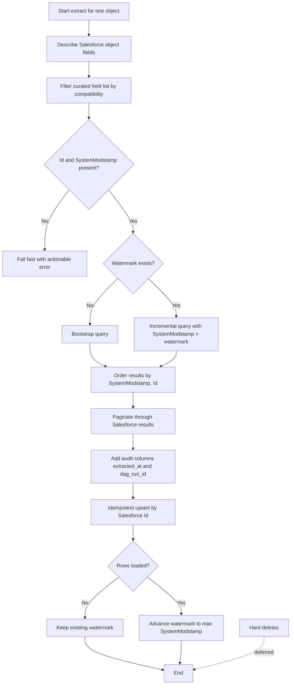

---
categories:
- data-engineering
- devops
- homelab
date: 2026-04-01 14:19:25 -0400
tags:
- airflow
- postgres
- salesforce
title: 'Kubernetes Managed Data Analytics Pipeline - Part 4: Salesforce Incremental
  Extraction'
mermaid: true
---

# Salesforce Incremental Extraction

This data pipeline needed a source system, and I wanted more hands-on exposure to owning and configuring Salesforce connections, so Salesforce became the input. This post covers the extraction contract I landed on: select fields deliberately, use `SystemModstamp` as the watermark, order results deterministically, and write in a way that survives retries.

Part 3 covered how Airflow launches and isolates the work. This part is about what one of those worker pods actually does once it starts talking to Salesforce. The rough shape is simple enough: query changed records, load them into Postgres, and repeat on a schedule.

## The Extraction Contract

The extraction flow starts by describing the object and comparing the fields available in Salesforce against a curated list of fields I actually want to move downstream. That avoids the usual `SELECT *` problem where one org changes, a field appears or disappears, and the pipeline suddenly behaves differently across environments. From there, the task checks that the minimum fields required for incremental loading are present, especially `Id` and `SystemModstamp`.

Once those fields are available, the rest of the contract is about keeping state and preserving order. A first run uses a bootstrap query. Later runs filter on `SystemModstamp` greater than the last saved watermark, order by `SystemModstamp` and `Id`, and page through the result set until the object is exhausted. The loaded rows get audit columns attached, then land in Postgres through an idempotent upsert keyed on the Salesforce record id. If a run retries, or if a task gets replayed, the result is still the same final state instead of duplicate rows.

## Repo

The Airflow pipeline repo, which holds the extraction code and task images, is here: <https://github.com/chris-jelly/de-airflow-pipeline>.

Specifically relevant here is the salesforce DAG: <https://github.com/chris-jelly/de-airflow-pipeline/tree/main/dags/salesforce> and the DBT transformation DAG: <https://github.com/chris-jelly/de-airflow-pipeline/tree/main/dags/dbt>

## Extraction Pattern

This is the logic in flowchart form. The main design goal is to narrow the space for surprises: select fields explicitly, keep ordering stable, and only advance the watermark after rows load successfully.

## Why `SystemModstamp`

Before this project, my default instinct for incremental Salesforce pulls was `LastModifiedDate` largely because that is what I had used in earlier integrations. While researching to set this up I learned of (and have swapped to using)  `SystemModstamp`. Salesforce recommends it for change tracking and incremental querying (<https://help.salesforce.com/s/articleView?id=000387261&type=1>).

The linked article is pretty brief, but to summarize, this helps catch cases where the Salesfoce system changes a value, as `LastModifiedDate` only tracks **user** modified changes. This wouldn't matter in a 'pull everything every time' extraction, but in our case it does matter since we need to know when any record is updated, whether by a user or by the Salesforce system. Glad to have learned this one!

## If This Were Production

One gap I am deliberately leaving for later is hard delete propagation. Right now the pipeline handles inserts and updates, but not records that disappear from Salesforce. It would be a gap in a real environment, but this demo environment won't have records deleted.

## What Comes Next

Part 5 stays on the Salesforce side, but from a different angle: how I use CumulusCI and Snowfakery to seed, mutate, and reset a realistic synthetic dataset so the extraction pipeline has something useful to chew on.
